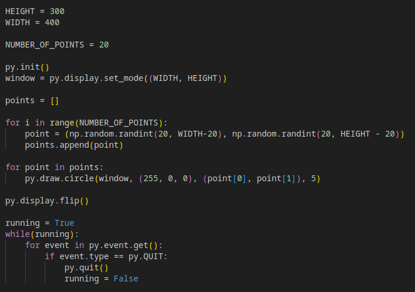
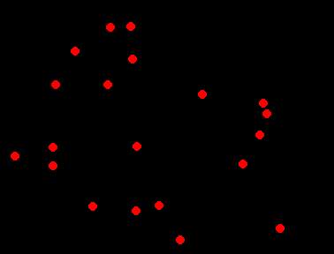
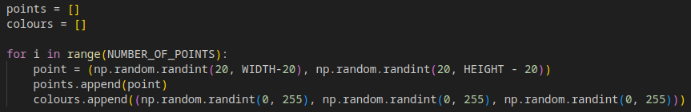
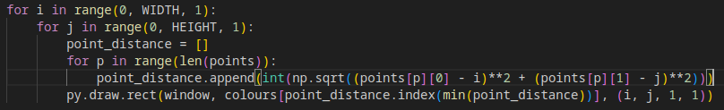
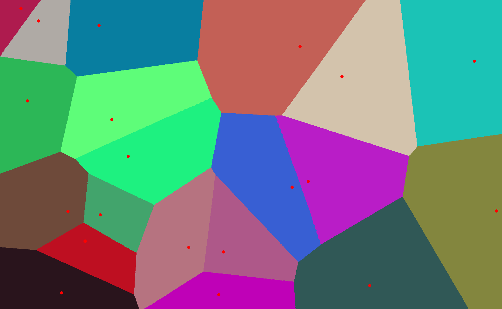

# How to Make a Town Map Generator
A simple fantasy town map generator using Voronoi diagrams to simulate hap-hazardly arranged streets rather than a simple grid structure.

## Voronoi Diagrams
My approach made use of Voronoi diagrams. Rather than use the inbuilt Voronoi functions in SciPy, I opted to code the diagrams myself, using PyGame as a renderer.

We start by generating points in random locations using Numpy's random.randint() function, and colouring those dots red for ease of visibility. Then we render them using PyGame.

 

The rendered output will look like:

For our Voronoi regions, we want them to be distinct colours, so in the point generation section, we can assign a random colour for each point to a colour array.

After this, we can colour in the regions. I went about this by iterating over each point (or series of points, using the STEP constant in the final file, for computing ease), and then used Pythagoras' theorem to determine the distances of each of our randomly generated points. By grabbing the index of the point of minimum distance, we also get the index of the corresponding colour in the colours array, since we interated over the random points in the order the were generated.

Rendering this out gives us a Voronoi diagram (rendered to 1600x1000 for visual niceness).

